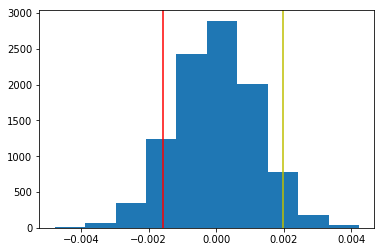
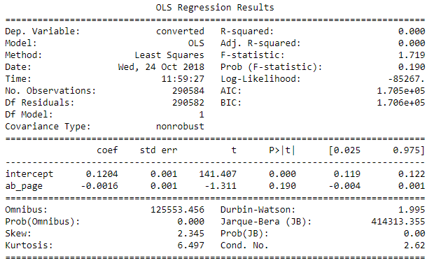

# Projeto de Estatística: Analisando os resultados de testes A/B - [Udacity](https://www.udacity.com/)

## Explicando o projeto
Testes A/B são comuns na área de data science. 
Nesse projeto foram analisados os resultados de um teste A/B executado por um site de comércio eletrônico. 
O objetivo foi auxiliar a empresa a entender se deve implementar a nova página, manter a página antiga ou executar o teste por mais tempo antes de tomar a decisão.

Os dados e o notebook Jupyter foram fornecidos pela Udacity. Algumas partes do notebook fazem referência a quizzes vinculados as aulas do curso.

#### Passos abaixo foram executados e documentados no `Analyze_ab_test_results_notebook.ipynb`:

## Execução do teste A/B
1. Calculado taxa de conversão da página nova e antiga
2. Simulado transações para ambas páginas com a taxa de conversão sob nulo.
3. Calculado diferença de conversão sob nulo.
4. Criado uma distribuição da variação das médias amostrais com base nos dados anteriores.
5. Calculado diferença das médias do dataframe original.
6. Plotado distribuição das diferenças das médias amostrais sob nulo. (Gráfico 01)
7. Calculado P-Value: Média de toda a distribuição de diferenças das méidas amostrais sob nulo que são maiores que a diferença das médias do dataframe real. Resultando em 0.9.
8. Com 5% de taxa de erro, o _p-value_ de 90% surgere que não há significância estatística e que foi mero acaso que a página nova se saiu melhor.

Gráfico 01:  
  
Linha vermelha: Diferença das médias.  
Linha amarela: Intervalo de confiança de 95%.

## Visualizando resultados via regressão
1. Definido utilização de regressão linearmente múltipla. Uma vez que há vários dados categóricos.
2. Criado variável de interceptação com valor 1.
3. Usado `statsmodels` para moldar regressão OLS e predizer se um indivíduo converte ou não.

Resultado do statsmodels:  

## Comparando resultados
O _p-value_ da regressão é de 0.19, enquanto do primeiro teste foi de 0.9. Essa diferença se dá devido à regressão linear aplicar um teste bicaudal, enquanto a outra aplica um teste unicaudal. 
O que basicamente deixa o cálculo do _p-value_ pelo menos com o dobro do valor.  
De todo modo ambos indicaram insignificância estatística.

#### Outros exercícios:
Durante o projeto foram respondidas e testadas outras questões estatísticas na qual não foram colocadas nesse arquivo inicial. 
Para uma visualização mais completa do projeto, acesse o notebook Jupyter.

#### Links úteis:
- [Como interpretar corretamente o P-Value](http://blog.minitab.com/blog/adventures-in-statistics-2/how-to-correctly-interpret-p-values)
- [Maldição da dimensionalidade](https://medium.com/@fabiolenine/como-selecionar-atributos-para-resolver-a-maldi%C3%A7%C3%A3o-da-dimensionalidade-5c810bc8449f)
- [Testes A/B](https://blog.hubspot.com/marketing/how-to-do-a-b-testing)
- [Unicaudal e bicaudal](https://statisticsbyjim.com/hypothesis-testing/one-tailed-two-tailed-hypothesis-tests/)
